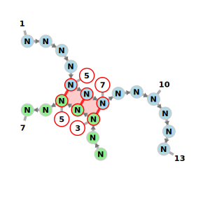
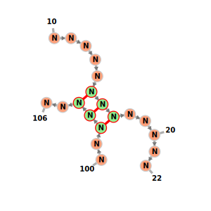
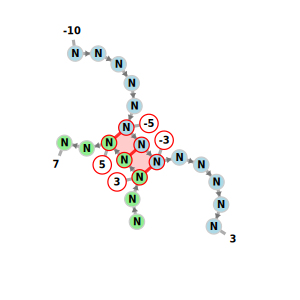
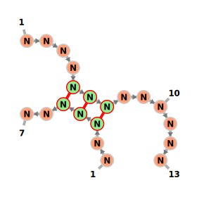
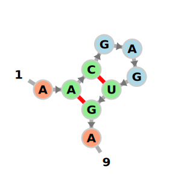
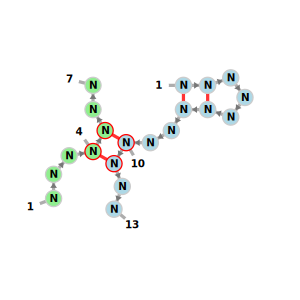
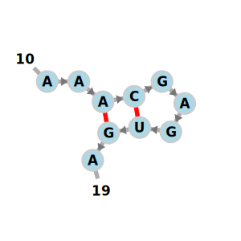
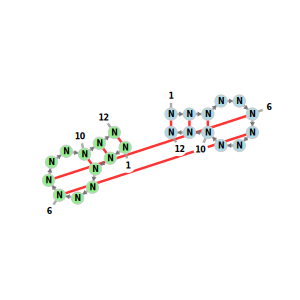
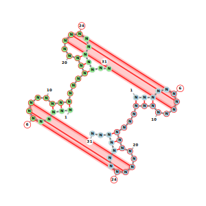

# vaRRI
This Tool creates a visualization for any working inter- and intramolecular structure and sequence involving one or two molecules, using FornaC.

Example for two distinctly colored molecules, with their intermolecular region highlighted:


~~~
./rna_to_img.py -u=".<<<....>>>.(((.<<<<<....>>>>>.(((..<<..>>..&..<<....>>..)))...)))." -e="NNNNNNNNNNNNNNNNNNNNNNNNNNNNNNNNNNNNNNNNNNNN&NNNNNNNNNNNNNNNNNNNNNN" -c=distinct -o=example.svg
~~~
# Overview

- [vaRRI](#varri)
- [Overview](#overview)
- [Installation](#installation)
- [Features](#features)
  - [Mandatory Parameters](#mandatory-parameters)
  - [Optional Parameters](#optional-parameters)
  - [Usage Examples](#usage-examples)


# Installation

We need to install

- playwright (tested and developed with v1.57.0)
- chromium browser (install via playwright)

```sh
# install dependencies
python3 -m pip install playwright==1.57.0
python3 -m playwright install chromium
# check version
python3 -m playwright --version
```

# Features

## Mandatory Parameters

<details>
<summary><code><b>-u</code>/ <code>--structure</code></b> Specifies the RNA secondary structure in dot-bracket notation.</summary>


| Notation | Meaning |
|----------|---------|
| `(` `)` | Base pair |
| `[` `]` | Alternative bracket pair (pseudoknot region 1) |
| `<` `>` | Alternative bracket pair (pseudoknot region 2) |
| `{` `}` | Alternative bracket pair (pseudoknot region 3) |
| `.` | Unpaired nucleotide |
| `&` | Separator between two molecules (intermolecular interaction) |


<table style="width:100%">
  <tr>
    <td> 
    <b> intramolecular:</b>
    <br/><br/>

```sh
rna_to_img.py \
  -u="((...))...." \
  -e="NNNNNNNNNNN"
```

</td>
    <td>
        <a href="test/verified/test1.svg">
            
        </a>
    </td>
  </tr>
  <tr>
    <td style="border:none;">
    <b>intermolecular:</b> 
    <br/><br/>

```sh
rna_to_img.py \
  -u="((...))..<<..&...>>.." \
  -e="NNNNNNNNNNNNN&NNNNNNN"
```

</td>
    <td style="border:none;">
        <a href="test/verified/test1.svg">
            
        </a>    
    </td>
  </tr>
</table>
<details>
<summary><b>Hybrid Input Format (Advanced)</b></summary>

The hybrid input format provides a convenient way to specify intermolecular base pairing interactions using position indices instead of dot-bracket notation.

**Format:**
```
<start_pos_1><pipes_and_dots>&<start_pos_2><pipes_and_dots>
```

Where:
- `<start_pos>`: Starting position (index, can be negative, can not be 0)
- `|`: Represents a base pair in the intermolecular interaction
- `.`: Represents an unpaired position within the interaction region

**How it works:**
- Both molecules must have the **same number** of `|` characters (representing the same number of base pairs)
- Interaction positions are defined relative to your sequence start Index
- The tool automatically converts hybrid input to standard dot-bracket notation

<table style="width:100%">
  <tr>
    <td> 
    <b> Example (simple interaction):</b><br/>
    Two sequences with interaction starting at position 5 (seq1) and position 3 (seq2) and each has 3 intermolecular base pairs
    <br/><br/>

```sh
./rna_to_img.py \
  -u="5|||..&3|||.." \
  -e="NNNNNNNNNNNNN&NNNNNNN"
```

<br/>
    </td>
    <td>
        <a href="test/verified/test13.svg">
            
        </a>
    </td>
  </tr>
  <tr>
    <td> 
    <b>Example (with custom start Index)</b><br/>
    Start indexing from position 10 (seq1) and 100 (seq2) <br/>
    Interaction starts at position 15 (seq1) and 102 (seq2)
    <br/><br/>

```sh
rna_to_img.py \
  -u="15|||..&102|||.." \
  -e="NNNNNNNNNNNNN&NNNNNNN" \
  -i1=10 \
  -i2=100
```

<br/>
    </td>
    <td>
        <a href="test/verified/test14.svg">
            
        </a>
    </td>
  </tr>
  <tr>
    <td> 
    <b>Example (negative positions):</b><br/>
    start indexing form -10 (seq1) and 1 (seq2) <br/>
    Interaction starts at position -5 (seq1) and 3 (seq2)
    <br/><br/>

```sh
rna_to_img.py \
  -u="-5|||..&3|||.." \
  -e="NNNNNNNNNNNNN&NNNNNNN" \
  -i1=-10 \
  -i2=1
```

<br/>
    </td>
    <td>
        <a href="test/verified/test15.svg">
            
        </a>
    </td>
  </tr>
</table>
<br/>

**Hybrid vs. Dot-Bracket Comparison:**
These two commands are equivalent:
<table style="width:100%">
  <tr>
    <td> 
    <b>Hybrid format:</b>
    <br/><br/>

```sh
rna_to_img.py \
  -u="5|||..&3|||" \
  -e="NNNNNNNNNNNNNN&NNNNN"
```

</td>
    <td>
        <a href="test/verified/test13.svg">
            
        </a>
    </td>
  </tr>
  <tr>
    <td style="border:none;">
    <b>Equivalent dot-bracket format:</b> 
    <br/><br/>

```sh
rna_to_img.py \
  -u="....(((......&..))).." \
  -e="NNNNNNNNNNNNN&NNNNNNN"
```

</td>
    <td style="border:none;">
        <a href="test/verified/test32.svg">
            
        </a>    
    </td>
  </tr>
</table>
</details>
<br/> 
</details>
<details>
<summary><code><b>-e</code>/ <code>--sequence</code></b> Specifies the RNA sequence using IUPAC nucleotide codes
</summary>

| Code | Nucleotide | Code | Nucleotide |
|------|-----------|------|-----------|
| `A` | Adenosine | `N` | Any nucleotide |
| `C` | Cytidine | `W` | Adenosine or Uridine |
| `G` | Guanosine | `S` | Cytidine or Guanosine |
| `U` | Uridine | `K` | Guanosine or Uridine |
| | | `&` | Separator between two molecules |

<table style="width:100%">
  <tr>
    <td> 
    <b>Example:</b>
    <br/><br/>

```sh
rna_to_img.py -u="((...))." -e="ACGAGUGA"
```

</td>
    <td>
        <a href="test/verified/test5.svg">
            
        </a>
    </td>
  </tr>
</table>
</details>

## Optional Parameters
<details>
<summary><code><b>-o</code>/ <code>--output</code></b> Specifies the output file name and format
</summary>


| Value | Description |
|-------|-------------|
| `STDOUT` (default) | Print SVG to standard output |
| `filename` | Save as SVG with given name |
| `filename.png` | Save as PNG with given name |

Examples:
```bash
# Output to stdout
rna_to_img.py -u="((...))." -e="ACGAGUGA" > output.svg

# Save as SVG file
rna_to_img.py -u="((...))." -e="ACGAGUGA" -o=structure

# Save as PNG file
rna_to_img.py -u="((...))." -e="ACGAGUGA" -o=structure.png
```
</details>

<details>
<summary><code><b>-c</code>/ <code>--coloring</code></b> Defines how nucleotides should be colored
</summary>


| Option | Description | Example |
|--------|-------------|---------|
| `default` (default) | Standard fornac coloring scheme |  <a href="test/verified/test27.svg">   </a> |
| `distinct` | Each molecule receives its own color | <a href="test/verified/test28.svg">  |

<table style="width:100%">
  <tr>
    <td> 
    <b>Example:</b>
    <br/><br/>
    
```sh
rna_to_img.py \
  -u="((...))..<<..&...>>.." \
  -e="NNNNNNNNNNNNN&NNNNNNN" \
  -c=distinct
```

</td>
    <td>
        <a href="test/verified/test3.svg">
            
        </a>
    </td>
  </tr>
</table>


</details>

<details>
<summary><code><b>-i</code>/ <code>--highlighting</code></b> Specifies which elements should be highlighted in intermolecular structures </summary>


<table style="width:100%">
  <tr>
    <td> 
    <b>Option</b>
    </td>
    <td>
    <b>Example Image</b>
    </td>
  </tr>
  <tr>
    <td> 
    <code>nothing</code>: no sepcial highlighting
    <br/><br/>

```sh
rna_to_img.py \
  -u="((...))..<<....<<..&..>>...>>.." \
  -e="NNNNNNNNNNNNNNNNNNN&NNNNNNNNNNN" \
  -i=nothing
```

<br/>
    </td>
    <td>
        <a href="test/verified/test27.svg">
            
        </a>
    </td>
  </tr>
    <tr>
    <td> 
    <code>basepairs</code>: Highlights only individual intermolecular base pairs
    <br/><br/>

```sh
rna_to_img.py \
  -u="((...))..<<....<<..&..>>...>>.." \
  -e="NNNNNNNNNNNNNNNNNNN&NNNNNNNNNNN" \
  -i=basepairs
```

<br/>
    </td>
    <td>
        <a href="test/verified/test23.svg">
            
        </a>
    </td>
  </tr>
    <tr>
    <td> 
    <code>region</code>(default): Highlights entire intermolecular interaction region
    <br/><br/>

```sh
rna_to_img.py \
  -u="((...))..<<....<<..&..>>...>>.." \
  -e="NNNNNNNNNNNNNNNNNNN&NNNNNNNNNNN" \
  -i=region
```

<br/>
    </td>
    <td>
        <a href="test/verified/test26.svg">
            
        </a>
    </td>
  </tr>
</table>


</details>

<details>
<summary><code><b>-i1</code>/ <code>--startIndex1</code></b> Sets the starting index for the first molecule's nucleotide numbering </summary>


| Parameter | Constraint |
|-----------|-----------|
| Default | `1` |
| Restriction | Cannot be `0` |

<table style="width:100%">
  <tr>
    <td> 
    <b>Example (start numbering at 10):</b>
    <br/><br/>

```sh
rna_to_img.py \
  -u="((...))." \
  -e="ACGAGUGA" \
  -i1=10
```

</td>
    <td>
        <a href="test/verified/test11.svg">
            
        </a>
    </td>
  </tr>
</table>

</details>
<details>
<summary><code><b>-i2</code>/ <code>--startIndex2</code></b> Sets the starting index for the second molecule's nucleotide numbering (only relevant for intermolecular structures) </summary>


| Parameter | Constraint |
|-----------|-----------|
| Default | `1` |
| Restriction | Cannot be `0` |

<table style="width:100%">
  <tr>
    <td> 
    <b>Example:</b>
    <br/><br/>
    
```sh
rna_to_img.py \
  -u="((...))..<<..&...>>.." \
  -e="NNNNNNNNNNNNN&NNNNNNN" \
  -i1=5 \
  -i2=100
```

</td>
    <td>
        <a href="test/verified/test12.svg">
            
        </a>
    </td>
  </tr>
</table>

</details>
<details>
<summary><code><b>-v</code>/ <code>--verbose</code></b>
 Enables detailed logging output for debugging and troubleshooting </summary>


```bash
./rna_to_img.py -u="((...))." -e="ACGAGUGA" -v
```
</details>

## Usage Examples

<table style="width:100%">
  <tr>
    <td> 
    <b>Simple Intramolecular Structure</b><br/>
    Visualization of a single RNA molecule with one hairpin loop:
    <br/><br/>

```sh
rna_to_img.py -u="((...))." -e="ACGAGUGA" > hairpin.svg
```


<br/>
    </td>
    <td>
        <a href="test/verified/test5.svg">
            
        </a>
    </td>
  </tr>
  <tr>
    <td> 
    <b>Intermolecular Interaction with Distinct Coloring</b><br/>
Two molecules interacting with distinct colors:
    <br/><br/>

```sh
rna_to_img.py \
  -u="((...))..<<..&...>>.." \
  -e="NNNNNNNNNNNNN&NNNNNNN" \
  -c=distinct \
  -o=interaction.svg
```

<br/>
    </td>
    <td>
        <a href="test/verified/test3.svg">
            
        </a>
    </td>
  </tr>
    <tr>
    <td> 
    <b>Custom Indexing</b><br/>
Start numbering from different positions for each molecule:
    <br/><br/>

```sh
rna_to_img.py \
  -u="((...))..<<..&...>>.." \
  -e="NNNNNNNNNNNNN&NNNNNNN" \
  -i1=5 -i2=100 \
  -o=custom_index.svg
```

<br/>
    </td>
    <td>
        <a href="test/verified/test12.svg">
            
        </a>
    </td>
  </tr>

  <tr>
    <td> 
    <b>Pseudoknot Structure (Simple)</b><br/>
A basic pseudoknot involving two interacting molecules:
    <br/><br/>

```sh
rna_to_img.py \
  -u="<<<..((..>>>&<<<..))..>>>" \
  -e="NNNNNNNNNNN&NNNNNNNNNNNN" \
  -c=distinct \
  -o=pseudoknot_simple.svg
```

<br/>
    </td>
    <td>
        <a href="test/verified/test29.svg">
            
        </a>
    </td>
  </tr>
  <tr>
    <td> 
    <b>Pseudoknot Structure (Complex - Kissing Hairpins)</b><br/>
Two molecules forming a complex kissing hairpin interaction:
    <br/><br/>

```sh
rna_to_img.py \
  -u="<<<..(((..>>>...<<<..(((..>>>..&<<<..)))..>>>...<<<..)))..>>>.." \
  -e="NNNNNNNNNNNNNNNNNNNNNNNNNNNNNNN&NNNNNNNNNNNNNNNNNNNNNNNNNNNNNNN" \ 
  -c=distinct \ 
  -o=kissing_hairpins.svg
```

<br/>
    </td>
    <td>
        <a href="test/verified/test30.svg">
            
        </a>
    </td>
  </tr>
</table>


