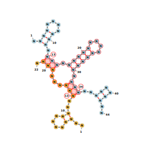
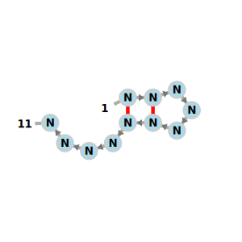
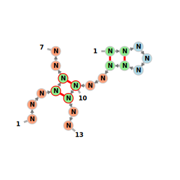
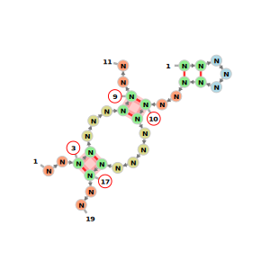
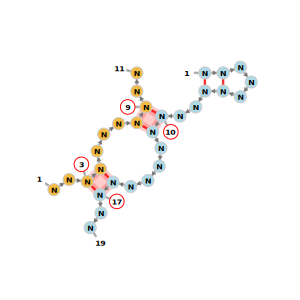
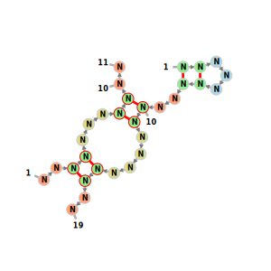
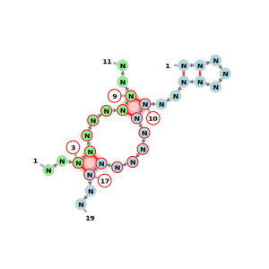

# vaRRI
This Tool creates a visualization for any working inter- and intramolecular structure and sequence involving one or two molecules, using FornaC.

Example for two distinctly colored molecules, with their intermolecular region highlighted:


~~~
./rna_to_img.py -u=".<<<....>>>.(((.<<<<<....>>>>>.(((..<<..>>..&..<<....>>..)))...)))." -e="NNNNNNNNNNNNNNNNNNNNNNNNNNNNNNNNNNNNNNNNNNNN&NNNNNNNNNNNNNNNNNNNNNN" -c=distinct -o=example.svg
~~~

# Installation
install playwright 
~~~
python3 -m pip install playwright==1.57.0
~~~
install chromium browser
~~~
python3 -m playwright install chromium
~~~
make sure that the playwright version is 1.57.0
~~~
python3 -m playwright --version
~~~

# Features

## Mandatory Parameters
### `-u` / `--structure`
Specifies the RNA secondary structure in dot-bracket notation.

| Notation | Meaning |
|----------|---------|
| `(` `)` | Base pair |
| `[` `]` | Alternative bracket pair (pseudoknot region 1) |
| `<` `>` | Alternative bracket pair (pseudoknot region 2) |
| `{` `}` | Alternative bracket pair (pseudoknot region 3) |
| `.` | Unpaired nucleotide |
| `&` | Separator between two molecules (intermolecular interaction) |


<table style="width:100%">
  <tr>
    <td> 
    <b> intramolecular:</b>
    <br/><br/> 
    <pre>./rna_to_img.py -u="((...))...." -e="NNNNNNNNNNN" </pre>
    </td>
    <td></td>
  </tr>
  <tr>
    <td style="border:none;">
    <b>intermolecular:</b> 
    <br/><br/>
    <pre>./rna_to_img.py -u="((...))..<<..&...>>.." -e="NNNNNNNNNNNNN&NNNNNNN" </pre>
    </td>
    <td style="border:none;"></td>
  </tr>
</table>


| Example | Image |
| :--- | ----: |
| **intramolecular:** <br/><br/>``` ./rna_to_img.py -u="((...))...." -e="NNNNNNNNNNN" ``` | [](test/verified/test1.svg) |
| **intermolecular:** <br/><br/>```./rna_to_img.py -u="((...))..<<..&...>>.." -e="NNNNNNNNNNNNN&NNNNNNN" ``` | [](test/verified/test2.svg)


<details>
<summary><b>Hybrid Input Format (Advanced)</b></summary>

The hybrid input format provides a convenient way to specify intermolecular base pairing interactions using position indices instead of dot-bracket notation.

**Format:**
```
<start_pos_1><pipes_and_dots>&<start_pos_2><pipes_and_dots>
```

Where:
- `<start_pos>`: Starting position (index, can be negative, can not be 0)
- `|`: Represents a base pair in the intermolecular interaction
- `.`: Represents an unpaired position within the interaction region

**How it works:**
- Both molecules must have the **same number** of `|` characters (representing the same number of base pairs)
- Interaction positions are defined relative to your sequence offset
- The tool automatically converts hybrid input to standard dot-bracket notation

**Example (simple interaction):**
```bash
# Two sequences with interaction starting at position 5 (seq1) and position 3 (seq2)
# Each has 3 base pairs and 2 unpaired positions
./rna_to_img.py -u="5|||..&3|||.." -e="NNNNNNNNNNNNN&NNNNNNN"
```
[Image](/test/verified/test13.svg)


**Example (with custom offsets):**
```bash
# Start numbering from position 10 (seq1) and 100 (seq2)
# Interaction starts at position 15 (seq1) and 102 (seq2)
./rna_to_img.py -u="15|||..&102|||.." -e="NNNNNNNNNNNNN&NNNNNNN" -o1=10 -o2=100
```
[Image](/test/verified/test14.svg)


**Example (negative positions):**
```bash
# Interaction can start before the sequence offset
./rna_to_img.py -u="-5|||..&3|||.." -e="NNNNNNNNNNNNN&NNNNNNN" -o1=-10 -o2=1
```
[Image](/test/verified/test15.svg)


**Hybrid vs. Dot-Bracket Comparison:**
These two commands are equivalent:
```bash
# Hybrid format
./rna_to_img.py -u="5|||..&3|||" -e="NNNNNNNNNNNNNN&NNNNN"

# Equivalent dot-bracket format
./rna_to_img.py -u="....(((.....&..)))" -e="NNNNNNNNNNNN&NNNNN"
```
[Image](/test/verified/test13.svg) vs [Image](/test/verified/test4.svg)


</details>


### `-e` / `--sequence`
Specifies the RNA sequence using IUPAC nucleotide codes.

| Code | Nucleotide | Code | Nucleotide |
|------|-----------|------|-----------|
| `A` | Adenosine | `N` | Any nucleotide |
| `C` | Cytidine | `W` | Adenosine or Uridine |
| `G` | Guanosine | `S` | Cytidine or Guanosine |
| `U` | Uridine | `K` | Guanosine or Uridine |
| | | `&` | Separator between two molecules |

Example:
```bash
./rna_to_img.py -u="((...))." -e="ACGAGUGA"
```
[Image](/test/verified/test5.svg)

---
## Optional Parameters
<details>
<summary><code><b>-o</code>/ <code>--output</code></b></summary>
Specifies the output file name and format.

| Value | Description |
|-------|-------------|
| `STDOUT` (default) | Print SVG to standard output |
| `filename` | Save as SVG with given name |
| `filename.png` | Save as PNG with given name |

Examples:
```bash
# Output to stdout
./rna_to_img.py -u="((...))." -e="ACGAGUGA" > output.svg

# Save as SVG file
./rna_to_img.py -u="((...))." -e="ACGAGUGA" -o=structure

# Save as PNG file
./rna_to_img.py -u="((...))." -e="ACGAGUGA" -o=structure.png
```
</details>

<details>
<summary><code><b>-c</code>/ <code>--coloring</code></b></summary>
Defines how nucleotides should be colored.

| Option | Description | Example |
|--------|-------------|---------|
| `default` (default) | Standard fornac coloring scheme | [](test/verified/test27.svg) |
| `distinct` | Each molecule receives its own color | [](test/verified/test28.svg) |


Example:
```bash
./rna_to_img.py -u="((...))..<<..&...>>.." -e="NNNNNNNNNNNNN&NNNNNNN" -c=distinct
```
[Image](/test/verified/test3.svg)


</details>

<details>
<summary><code><b>-i</code>/ <code>--highlighting</code></b></summary>
Specifies which elements should be highlighted in intermolecular structures (only applies to 2-molecule systems).

| Option | Description | Example |
|--------|-------------|---------|
| `nothing` | No special highlighting| [](test/verified/test27.svg) |
| `basepairs` | Highlights only individual intermolecular base pairs: | [](test/verified/test23.svg) |
| `region` (default) | Highlights entire intermolecular interaction region | [ ](test/verified/test26.svg) |


```bash
# Highlight entire interaction region
./rna_to_img.py -u="((...))..<<....<<..&..>>...>>.." -e="NNNNNNNNNNNNNNNNNNN&NNNNNNNNNNN" -i=region

# Highlight only base pairs
./rna_to_img.py -u="((...))..<<....<<..&..>>...>>.." -e="NNNNNNNNNNNNNNNNNNN&NNNNNNNNNNN" -i=basepairs

# No highlighting
./rna_to_img.py -u="((...))..<<....<<..&..>>...>>.." -e="NNNNNNNNNNNNNNNNNNN&NNNNNNNNNNN" -i=nothing
```
</details>

<details>
<summary><code><b>-o1</code>/ <code>--offset1</code></b></summary>
Sets the starting index for the first molecule's nucleotide numbering.

| Parameter | Constraint |
|-----------|-----------|
| Default | `1` |
| Restriction | Cannot be `0` |

**Example (start numbering at 10):**
```bash
./rna_to_img.py -u="((...))." -e="ACGAGUGA" -o1=10
```
[Image](/test/verified/test11.svg)

</details>
<details>
<summary><code><b>-o2</code>/ <code>--offset2</code></b></summary>
Sets the starting index for the second molecule's nucleotide numbering (only relevant for intermolecular structures).

| Parameter | Constraint |
|-----------|-----------|
| Default | `1` |
| Restriction | Cannot be `0` |

Example:
```bash
./rna_to_img.py -u="((...))..<<..&...>>.." -e="NNNNNNNNNNNNN&NNNNNNN" -o1=5 -o2=100
```
[Image](/test/verified/test12.svg)

</details>
<details>
<summary><code><b>-v</code>/ <code>--verbose</code></b></summary>
Enables detailed logging output for debugging and troubleshooting.

```bash
./rna_to_img.py -u="((...))." -e="ACGAGUGA" -v
```
</details>

---

## Usage Examples

### Simple Intramolecular Structure
Visualization of a single RNA molecule with one hairpin loop:

```bash
./rna_to_img.py -u="((...))." -e="ACGAGUGA" > hairpin.svg
```
[Image](/test/verified/test5.svg)


### Intermolecular Interaction with Distinct Coloring
Two molecules interacting with distinct colors:
!This Picture has already been an example. show it again?

```bash
./rna_to_img.py -u="((...))..<<..&...>>.." -e="NNNNNNNNNNNNN&NNNNNNN" -c=distinct -o=interaction.svg
```
[Image](/test/verified/test3.svg)

### Custom Indexing
Start numbering from different positions for each molecule:
!This Picture has already been an example. show it again?

```bash
./rna_to_img.py -u="((...))..<<..&...>>.." -e="NNNNNNNNNNNNN&NNNNNNN" -o1=5 -o2=100 -o=custom_index.svg
```
[Image](/test/verified/test12.svg)


## Advanced Examples

### Pseudoknot Structure (Simple)
A basic pseudoknot involving two interacting molecules:
```bash
./rna_to_img.py -u="<<<..((..>>>&<<<..))..>>>" -e="NNNNNNNNNNN&NNNNNNNNNNNN" -c=distinct -o=pseudoknot_simple.svg
```
[Image](/test/verified/test29.svg)


### Pseudoknot Structure (Complex - Kissing Hairpins)
Two molecules forming a complex kissing hairpin interaction:
```bash
./rna_to_img.py -u="<<<..(((..>>>...<<<..(((..>>>..&<<<..)))..>>>...<<<..)))..>>>.." -e="NNNNNNNNNNNNNNNNNNNNNNNNNNNNNNN&NNNNNNNNNNNNNNNNNNNNNNNNNNNNNNN" -c=distinct -o=kissing_hairpins.svg
```
[Image](/test/verified/test30.svg)

