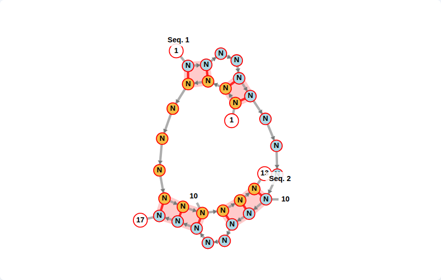

# RNA force graph

The canvas constructs its own graph in
[`structure.js`](../src/core/canvas/graph/structure.js). It uses the pinned D3
7.9.0 force engine and extracted RNA layout algorithms, with provenance and
Apache licensing in [`NOTICE.md`](../src/core/canvas/graph/NOTICE.md).
It never instantiates or loads `fornac.js`.
The [D3 upgrade audit](d3-upgrade.md) describes the simulation adapter and
verification against the reviewed phase-4 geometry.

## Nucleotides and strand boundaries

There is one nucleotide node per real sequence character. IDs are contiguous,
one-based integers across both strands. `&` is a boundary marker, not a node.
The graph stores the end index of each strand in `breaks`. Backbone links join
adjacent nucleotides only within a strand; each base pair is added once.

The old implementation inserted three dots after `&` to compensate for
Fornac's conversion of break-adjacent nucleotides into invisible nodes. That
padding and the later DOM removal are gone. Biological positions are computed
by `model/indexing.js`, including negative offsets and skipping zero. Internal
IDs are not biological positions and should not be persisted in share links.
Two explicitly typed, invisible layout vertices now separate each strand break.
They have no nucleotide ID or biological position. A temporary polygon pair
table includes them; its coordinates are mapped back to the real nodes. They
also participate in loop forces, so enabling animation retains the gap.

## Coordinates and crossings

The initial coordinates use the original polygon algorithm in
`graph/coordinates.js`. Maximum-cardinality planarization chooses a noncrossing
subset for initial layout; the complete pair table is retained. Crossing pairs
are visible `pseudoknot` links. Their force strength is initially zero and can
be raised by `pullPseudoknotBasepairs`.

Removing padding changes two-strand polygon geometry even with animation off.
The original phase-1 screenshots remain immutable reference fixtures. New
fixtures must be reviewed for topology, labels, highlights, and export as well
as shape; see the [migration protocol](../MIGRATION_PROTOCOL.md).

## Force constraints

Nucleotides and labels participate in repulsion and springs. Invisible geometric
hubs preserve loop and stem shape. These hubs are deliberate force constraints,
not fake nucleotides; they never appear in the SVG or biological index map.
Each hub records its members and `scaffoldType`, and each chord records its
owning `scaffoldUid`.

Fornac's two outer closure helpers are included when sizing exterior springs.
As upstream, they receive incoming chords but do not originate spokes. Stem
rectangles and loops retain reciprocal hidden chords as separate springs;
deduplicating these chords weakens the constraints. Real base pairs remain
unique. The independent legacy-browser oracle tests hidden endpoints,
multiplicity, and spring lengths against the pinned Fornac runtime.

When `pullPseudoknotBasepairs` is enabled, pseudoknot helices use the same
scaffold builder as ordinary helices. Each contiguous stack receives a central
hub, four spokes, and both reciprocal diagonals. Intervening unpaired bases
form an interior-loop polygon with its own hub and chords. Neighboring hubs
sharing nucleotides are connected. Spring lengths, strengths, hub radii, and
charges follow the existing ordinary-scaffold rules; pseudoknot springs are
ordinary hidden `fake`/`fake_fake` links.

Both sides must follow real backbone edges, so these constraints never cross a
strand break. Loop discovery stops at another paired nucleotide and never
skips an intervening pairing. Isolated pseudoknot pairs get only the pair pull.
Generated hubs and links carry `pseudoknotScaffold` metadata, survive free-end
cleanup, remain absent from SVG/PNG output, and are removed when pulling is
disabled. D3 then refreshes both nodes and links, restoring the original force
graph, charge sources, and link-degree bias.

Martin's [review of PR #98](https://github.com/BackofenLab/vaRRI/pull/98#issuecomment-6001717945)
showed that diagonals alone left the crossing-RRI example distorted. The
corrected upper helix has two stem hubs, an interior-loop hub for its bulge,
and 36 hidden springs, matching the equivalent ordinary helix exactly.
The labeled example regression compares its upper and lower stack angles after
convergence with free ends. The actual Vue example is also checked through the
example selector, with a screenshot and angle measurements saved under
`output/playwright/ui/crossing-rri-stacks.*`. All 30 nucleotides and 10 real
pairs remain visible. Existing animation-off visual baselines are unchanged.

The reviewed screenshot below was captured by `npm run test:ui` using Chromium
153.0.8010.12 at a 1440 × 1000 viewport. The example selector loads the normal
defaults; the test waits for convergence and zooms out for the capture without
changing graph geometry. Maximum corner deviation from 90° is 9.46° in the
upper pseudoknot stacks and 10.00° in the lower ordinary stacks.

`freeTrailingEnds` removes exterior hubs, virtual vertices, and their constraints while retaining
real nucleotides and interior-loop constraints, including constraints that share
a nucleotide with an exterior loop. Real nucleotide identity never changes.

Linear RRI and intramolecular options construct two-rail helix templates from
the validated pair structure. Projection preserves handedness, handles bulges
and interior loops, and respects fixed nodes. Index labels receive a bounded
outward adjustment. RRI horizontalization is a rigid graph rotation, and the
viewport refits once at force convergence. Both linear options also work with
Force layout disabled: the same constraints settle for at most 60 synchronous
ticks, then the force and its constraint listeners stop before rendering is
shown. This creates a static linear layout without fixing its nodes; dragging,
release, reset, and undo remain available.

## Drawing and lifecycle

The force graph is ordinary JavaScript data held by a core instance. Vue must
never wrap it in `ref()` or `reactive()`. SVG joins and force listeners are scoped
to the target element. The historical CSS class names remain compatible with
the existing stylesheet and annotation helpers.

Starting a replacement render cancels pending annotation work, detaches linear
layout listeners, stops the old force, disconnects its resize observer, and
removes drag/zoom handlers. A pending render resolves with `{ cancelled: true }`.
Different `createVaRRI()` instances keep separate colors, registries, roots, and
lifecycle state. Call `cancelActiveRender()` when removing a viewer.

Tests cover topology, finite force positions, fixed-node behavior, rail geometry,
label bias, cancellation, separate instances, and browser export.
