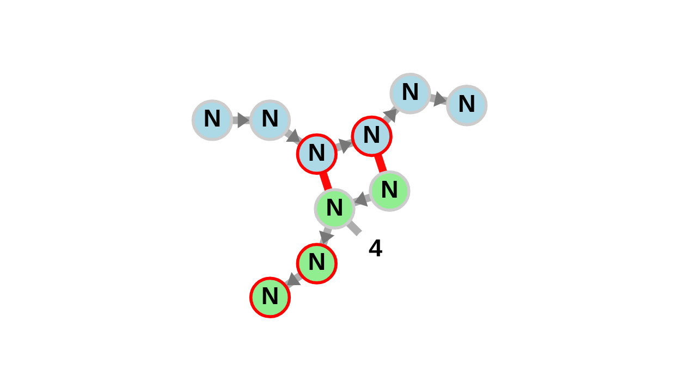
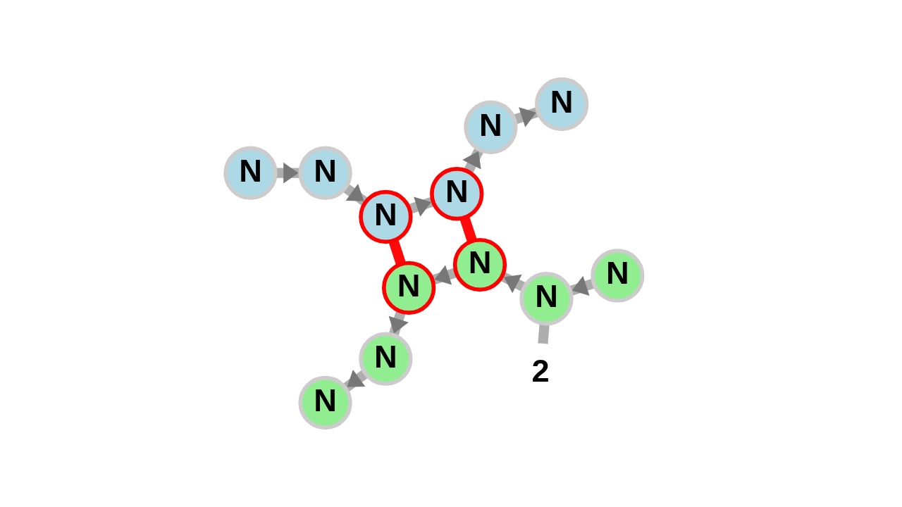
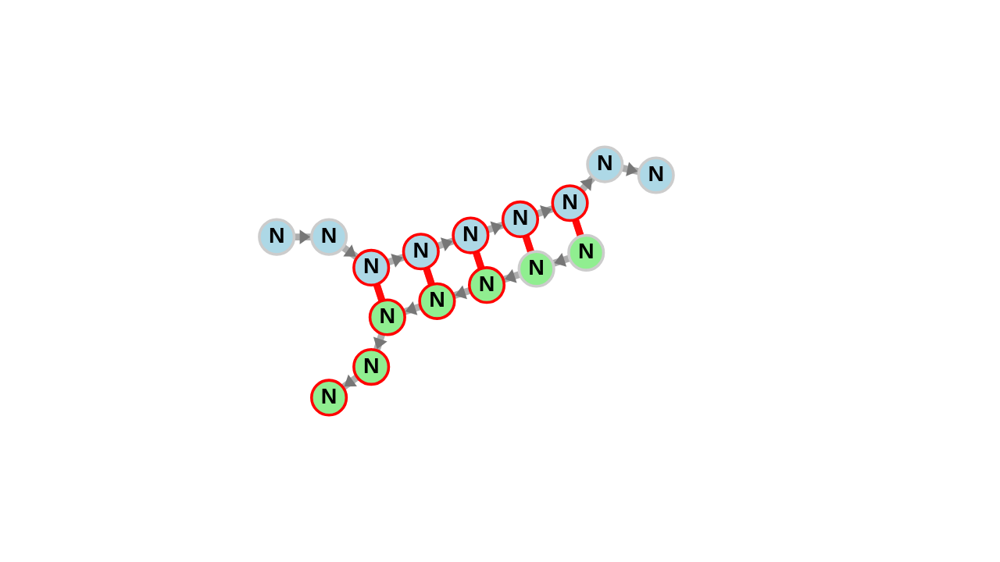

## Hotfix 1

if an interaction between 2 Molecules is given, fornac does not display 
the first 2 nucelotides of the second molecule.

example:

~~~
./rna_to_img.py –structure="..((..&..)).." –sequence="NNNNNN&NNNNNN" 
~~~
| forna | fixed|
| --- | --- |
|||

The reason fornac removes 2 nodes if given 2 structures is it renders them invisible to create a gap between the 2 molecules.

To fix this issue, the script always adds 2 superficial nodes at the beginning of the second molecule to circumvent the problem.

## Hotfix 2

fornac uses "markers" in a default 10 interval to give an overview over the molecules. 
This marker does not account for the 2 invisible nodes. If a marker overlaps with the invisible Nodes, a useless artifact is visible.

| forna | fixed|
| --- | --- |
|||

To fix this issue the script makes the marker invisible if it overlaps with the invisible Nodes.